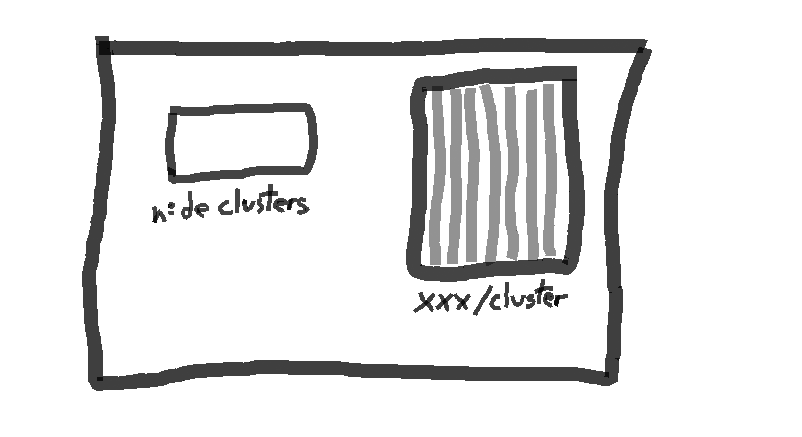
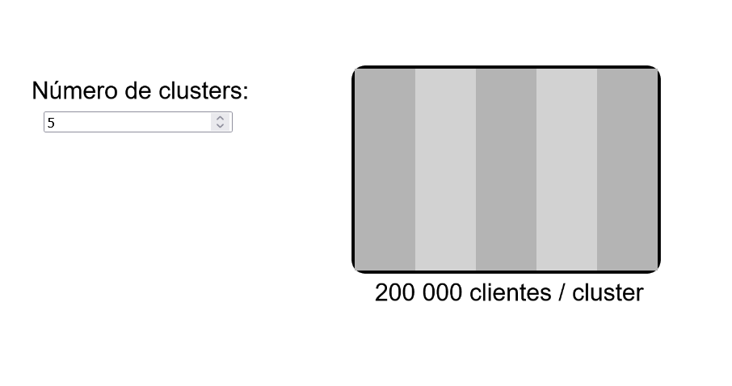
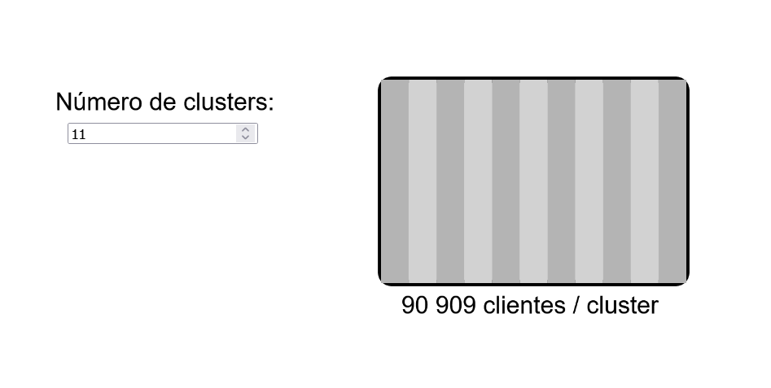

# Introdução

Um dos principais recursos utilizados por algoritmos é a clusterização. O seu objetivo é agregar diversas entradas em uma, para assim economizar recursos computacionais, tornando a resposta mais rápida e eficiente. Dessa forma, um dos parâmetros que poderá ser controlados pelos operadores se trata da quantidade de clusters formados. No entanto, algo que pode não ser tão claro é o tamanho relativo do número escolhido. Por isso, o objetivo do projeto é trazer uma representação visual para a quantidade de clusters escolhida, assim buscando tornar mais claro os tamanhos de cada agrupamento.

# Rascunho

 

 Na esquerda, está presente um campo para a seleção da quantidade de clusters desejada, permitindo que o usuário selecione a quantidade. Na direita, um retângulo busca representar a base de dados. A representação do retângulo deverá ser cortada no número de clusters definido, assim representando as frações da base de dados. Embaixo, a quantidade de clientes por cluster também deverá ser explicitada.

 # Resultados obtidos

  

   